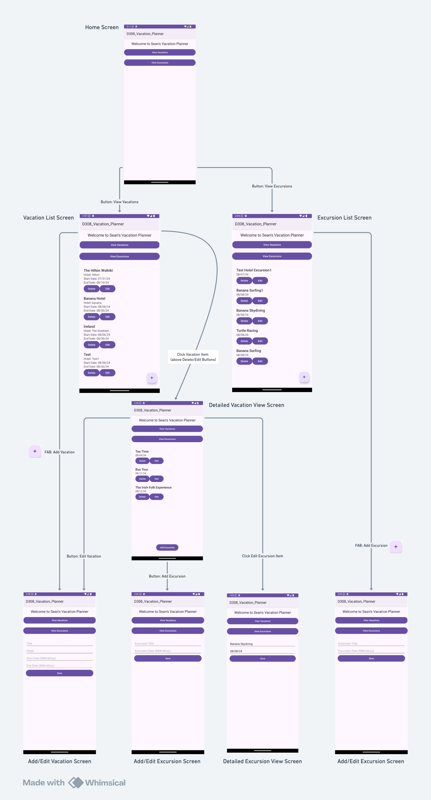

# Sean's Vacation Tracker

#### This MVP mobile app that was built to provided specifications for my college course D308.

# _Mobile Application Development (Android)_

#### By _**Sean Keane**_

#### WGU Code Review 08/07/2024

## Link to Repository
[Repository Link](https://gitlab.com/wgu-gitlab-environment/student-repos/SeanKeaneWGU/d308-mobile-application-development-android.git)

## Description

_I created a Java project for my B.S. in Software Engineering that manages vacations and excursions for travelers. The application allows users to enter, edit, and delete vacation and excursion data. It provides a list and detailed views of vacations and excursions and includes alerts for vacation start and end dates. The application uses the Room Framework as an abstraction layer over the local SQLite database._

## Technology Used

* Java
* Android Studio
* Room Framework
* SQLite
* XML

## Setup/Installation Requirements

1) Clone this repository to your desktop.
2) Open the project in Android Studio.
3) Build the project by clicking the play button or running the build command.
4) Deploy the APK to an Android device or emulator running Android 8.0 or higher.

## How to Operate the Application (refer to the below diagram)

1. **Home Screen:**
    - Use the buttons to navigate to the Vacation List Screen or the Excursion List Screen.

2. **Vacation List Screen:**
    - View a list of all vacations.
    - Add a new vacation using the FAB (Floating Action Button) at the bottom right.
    - Edit or delete existing vacations using the respective buttons.

3. **Add/Edit Vacation Screen:**
    - Enter the vacation title, hotel, start date, and end date.
    - Save the vacation details.

4. **Detailed Vacation View Screen:**
    - View all details of a selected vacation.
    - View a list of associated excursions.
    - Add a new excursion using the button.
    - Edit the vacation details using the button.

5. **Excursion List Screen:**
    - View a list of all excursions.
    - Add a new excursion using the FAB at the bottom right.
    - Edit or delete existing excursions using the respective buttons.

6. **Add/Edit Excursion Screen:**
    - Enter the excursion title and date.
    - Save the excursion details.

7. **Detailed Excursion View Screen:**
    - View all details of a selected excursion.
    - Edit the excursion details using the button.

### Logic Flow of Built Application

## Deployment

The signed APK is deployed to Android 8.0 (API level 26) and higher. Make sure to test the APK on a compatible device or emulator.

## Known Bugs

* No known bugs.

## License

If you have any questions or concerns, feel free to contact me at code@sean-keane.com

*This is licensed under the MIT license*

Copyright (c) 08-07-2024 **_Sean Keane_**