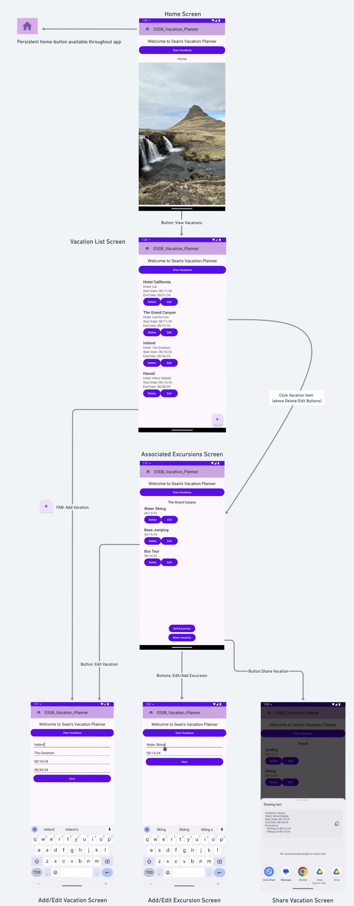

# Sean's Vacation Tracker

#### This MVP mobile app that was built to provided specifications for my college course D308.

# _Mobile Application Development (Android)_

#### By _**Sean Keane**_

#### WGU Code Review 08/07/2024

## Link to Repository
[Repository Link](https://gitlab.com/wgu-gitlab-environment/student-repos/SeanKeaneWGU/d308-mobile-application-development-android/-/tree/Working_Branch2?ref_type=heads)

## Description

_I created a Java project for my B.S. in Software Engineering that manages vacations and excursions for travelers. The application allows users to enter, edit, and delete vacation and excursion data. It provides a list and detailed views of vacations and excursions and includes alerts for vacation start and end dates. The application uses the Room Framework as an abstraction layer over the local SQLite database._

## Technology Used

* Java
* Android Studio
* Room Framework
* SQLite
* XML

## Setup/Installation Requirements

1) Clone this repository to your desktop.
2) Open the project in Android Studio.
3) Build the project by clicking the play button or running the build command.
4) Deploy the APK to an Android device or emulator running Android 8.0 or higher.

## How to Operate the Application (refer to the below diagram)

1. **Home Screen:**
    - Use the "View Vacations" button to navigate to the Vacation List Screen.
    - The Home button is persistent throughout the app, allowing you to return to the Home Screen from any other screen.

2. **Vacation List Screen:**
   - View a list of all vacations.
   - Each vacation shows its title, hotel, start date, and end date.
   - Add a new vacation using the FAB (Floating Action Button) at the bottom right.
   - Edit or delete existing vacations using the respective buttons.

3. **Detailed Vacation View:**
   - Access this view by clicking on a vacation in the list.
   - View all details of the selected vacation, including the associated excursions.
   - Add, edit, or delete excursions from this screen.
   - Edit the vacation details or share the vacation via email, SMS, or clipboard.

4. **Excursion List Screen (Associated with a Vacation):**
   - View a list of all excursions associated with the selected vacation.
   - Each excursion shows its title and date.
   - Add a new excursion using the button at the bottom of the screen.
   - Edit or delete existing excursions using the respective buttons.
   - Share the vacation's details using the share button.

5. **Add/Edit Vacation Screen:**
   - Enter the vacation title, hotel, start date, and end date.
   - Save the vacation details.
   - Validation ensures the end date is after the start date.

6. **Add/Edit Excursion Screen:**
   - Enter the excursion title and date.
   - Save the excursion details.
   - Validation ensures the excursion date is within the vacation date range.

7. **Share Vacation Screen:**
   - Access the sharing options from the Detailed Vacation View or the Excursion List Screen.
   - The vacation details will be automatically populated for sharing via email, SMS, or clipboard.

### Logic Flow of Built Application

## Deployment

The signed APK is deployed to Android 8.0 (API level 26) and higher. Make sure to test the APK on a compatible device or emulator.

## Known Bugs

* No known bugs.

## License

If you have any questions or concerns, feel free to contact me at code@sean-keane.com

*This is licensed under the MIT license*

Copyright (c) 08-07-2024 **_Sean Keane_**